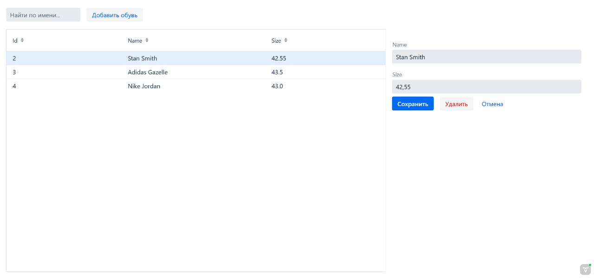

# Сервер работы с базой данных обуви
Учебное FullStack приложение на Java 

## Возможности
* Create - создавать новую запись
* Read - читать все записи, а также искать по имени
* Update - обновлять информацию записи
* Delete - удалять старую запись

## Технологии
* База данных: MySQL
* Backend: Java Spring MVC
  - Model
  - View
  - Controller

* Frontend: Vaadin - Java фреймворк для фронтенда
